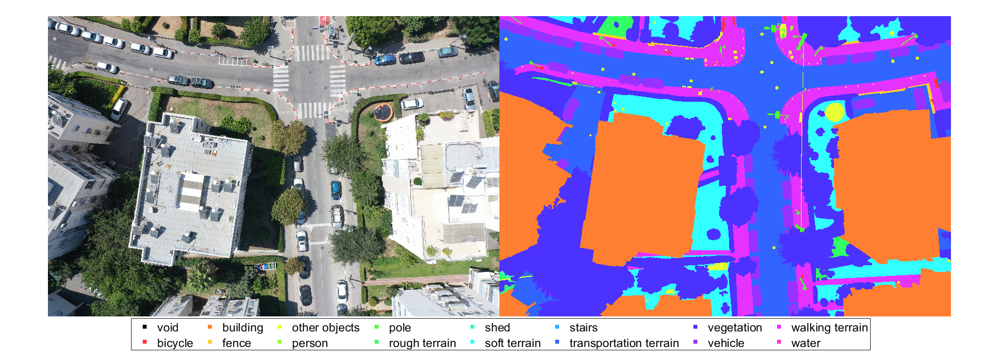
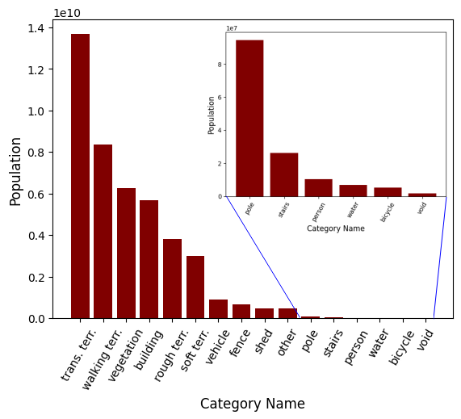
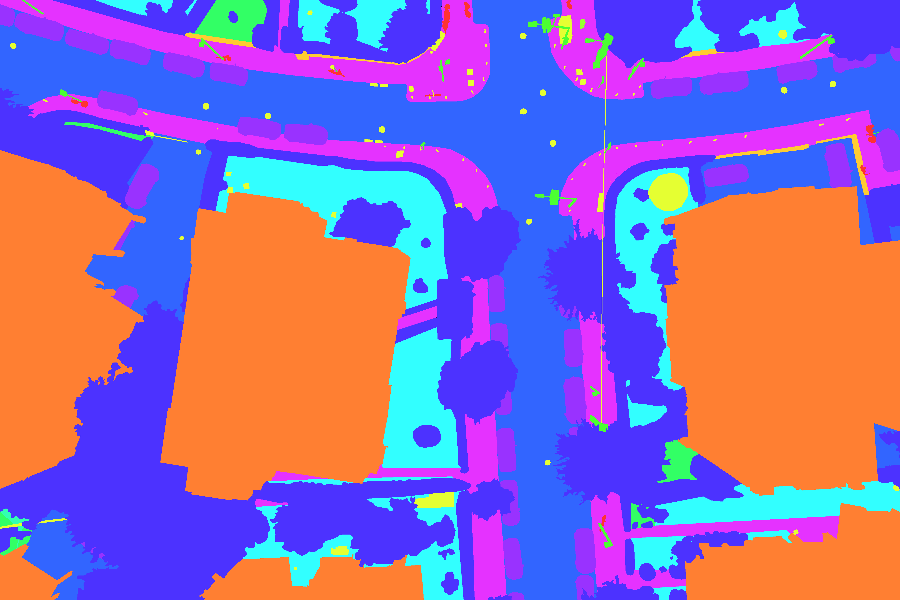

<h1> MESSI: A Multiple-Elevation Semantic Segmentation Image dataset for aerial urban environment exploration
  
## Updates
* 19/10/2022 v1.0 release
  
## Overview
  Semantic Segmentation has recently been proposed as a detection sensor searching for an appropriate landing place in a dense urban environment. This provocative idea is motivated by the availability of drones capable of flying at various altitudes over the environment while taking images with correspondingly diverse spatial resolutions together with emerging deep learning tools for performing the segmentation in almost real-time. Unfortunately, existing datasets collected by drones fail to provide the altitude (or elevation) richness required to evaluate the new search approach.
To circumvent this difficulty, a new dataset was collected using images taken by a drone flying at different altitudes in a relatively dense urban environment. The data was collected flying on a single day over selected areas of the cities of Netanya and Tel Aviv at altitudes that vary from 30, 50, 70, and 100 m and following several straight paths. In addition, images were taken while the drone descended over specific points to facilitate a correlation study of the different segmented results. The dataset consists of 2525 images taken using a high-resolution, downward-looking RGB camera mounted on a remote-control drone. The drone was flown by [ALTA INNOVATION](https://alta.team/), a local company licensed to fly over urban areas. [V7](https://www.v7labs.com/) was contracted to provide dense-pixel-wise annotations using its data labeling software. In addition to the annotated images, the dataset contains localization data computed by the drone using an INS/GPS navigation system.
MESSI is made available to the general research community to facilitate the development of new algorithms for semantic segmentation in an urban environment. The dataset can also be used for exploring new visual odometry algorithms in urban environments.

## Platform and Equipment
  The drone used to collect images is a remotely controlled DJI MAVIC 2 PRO. Due to regulation limitations, the drone was flown at line-of-sight over streets.
The downward-looking RGB camera was a DJI-FC6310R with a 5472×3648 resolution. Images were taken so that two subsequent ones have an approximately 70% overlap between images. The INS/GPS uses RTK positioning for maximum accuracy. Orientation was obtained from a magnetometer carefully placed on the platform to minimize magnetic disturbances.
  
 ## Annotated Data
  
  Data were annotated using V7 image annotation tool. The company was selected because its annotation software is designed to speed up the annotation of images with a relatively large overlap area. Annotations include 16 different classes (including the “void” class of unannotated pixels. The next figures show the statistical distribution. The challenges of the dataset are clearly observable from the plot.
 
  

    
    
    
  <!--  Class Population Histogram | -->
  <!--  :-------------------------:| -->
  <!--   |
 
  
   
 <!--  (Original Image             |  Ground Truth Annotation) -->
<!--  (:-------------------------:|:-------------------------:) -->
<!--  (  |  ) -->
  
 ## Folder structure
  
  <pre>
  Folder PATH listing
Volume serial number is 000000DA 3CE1:97E2
O:\ALTA\MESSI DATASET
├───Test
│   ├───6DOF
│   │   ├───Ha-Medinah Square
│   │   │   └───Path
│   │   │       └───60
│   │   └───IrYamim
│   │       └───Path
│   │           ├───30
│   │           ├───...
│   │           └───100
│   └───images
│       ├───Ha-Medinah Square
│       │   └───Path
│       │       └───60
│       └───IrYamim
│           └───Path
│               ├───30
│               ├───...
│               └───100
└───Train and Val
    ├───6DOF
    │   └───Agamim
    │       ├───Descend
    │       │   ├───100_0001
    │       │   ├───...
    │       │   └───100_0043
    │       └───Path
    │           ├───A
    │           │   ├───30
    │           │   ├───...
    │           │   └───100
    │           ├───B
    │           │   ├───30
    │           │   ├───...
    │           │   └───100
    │           └───C
    │               ├───30
    │               ├───...
    │               └───100
    ├───annotations
    │   └───Agamim
    │       ├───Descend
    │       │   ├───100_0001
    │       │   ├───...
    │       │   └───100_0043
    │       └───Path
    │           ├───A
    │           │   ├───30
    │           │   ├───...
    │           │   └───100
    │           ├───B
    │           │   ├───30
    │           │   ├───...
    │           │   └───100
    │           └───C
    │               ├───30
    │               ├───...
    │               └───100
    └───images
        └───Agamim
            ├───Descend
            │   ├───100_0001
            │   ├───...
            │   └───100_0043
            └───Path
                ├───A
                │   ├───30
                │   ├───...
                │   └───100
                ├───B
                │   ├───30
                │   ├───...
                │   └───100
                └───C
                    ├───30
                    ├───...
                    └───100
  </pre>

 ## Dataset Download
